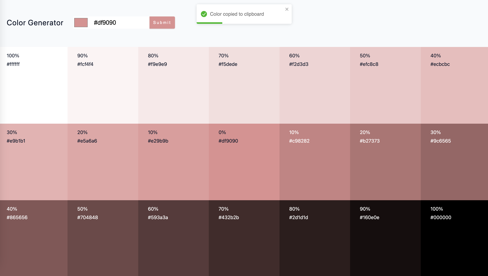

## ColorBurst

This React project is a color generator application that allows users to `input color values`. The application generates a list of colors based on user inputs. Each color in the list is displayed with its hex value and weight percentage. Users can `copy the hex value` of a color to the `clipboard` by clicking on it. The project also includes features like `error handling` for color generation failures and displaying `toast messages` for user interactions.

### Tech Stack
- `JavaScript`
- `React` JavaScript library used for building the project:
- - `useState` React hook used to manage state and create a state variable for the questions array.
- `nanoid`: A library used for generating unique IDs, enhancing data handling and management within the project.
- `navigator.clipboard`: Used to access the system clipboard in order to read the contents of the clipboard.
### Explore The Website
[ColorBurst on Netlify](https://color-burst.netlify.app/)

### Preview

